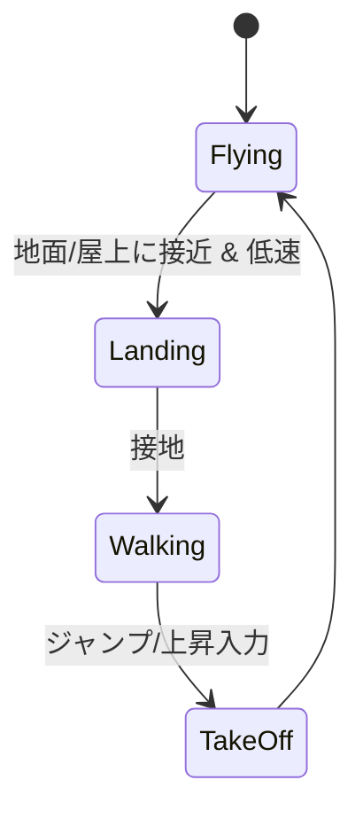

# skyroam — 東アジア上空を鳥で飛ぶゲーム

## コンセプト

日本の都会の上空を鳥になって飛ぶ。着地すれば地面を歩ける。飛び続ければ海を越えて
韓国・中国・ロシアへ行ける。時間は朝→昼→夜と巡り、空には飛行機・流れ星・隕石が流れる。
現在地は地図で確認できる。PC / スマホの両方で遊べる。

## 技術スタック

| 領域 | 選定 | 理由 |
| --- | --- | --- |
| 3D | Three.js | Web ネイティブ。GitHub Pages に静的配信でき、スマホブラウザで動く |
| 言語 | TypeScript | 座標変換・状態機械が多く、型が無いと破綻する |
| ビルド | Vite | 開発サーバが速く、`base` 設定だけで Pages に載る |
| デプロイ | GitHub Actions → GitHub Pages | push ごとに自動更新。進捗を常に URL で確認できる |
| BGM | YouTube IFrame Player API | 指定 URL を規約準拠で再生する唯一の方法（音声抽出は規約違反） |

> Unity ではなく Three.js を選んだ経緯: Unity WebGL はモバイルブラウザが公式非対応で、
> かつビルドに Unity Editor の手動操作が必要なため「GitHub Pages で進捗を確認しながら進める」
> という要件を満たせない。ゲーム設計（データ構造・仕様）は本ファイルに残すので、
> 将来 Unity へ移植する余地は保つ。

## 核となる設計判断

### 1. ワールド座標系 = 実緯度経度の投影

地図表示と「実在の国に行ける」を両立するため、ワールド座標は実際の緯度経度から導出する。

- 原点: 東京駅 (35.6812N, 139.7671E)
- 投影: 原点を基準にした等距円筒近似
  - `x = (lon - lon0) * 111_320 * cos(lat0) / SCALE`
  - `z = -(lat - lat0) * 110_574 / SCALE`
- 対象範囲: 北緯 20〜55°, 東経 118〜152°（日本・朝鮮半島・中国東岸・極東ロシア）

### 2. 距離圧縮 `SCALE = 20`

実距離のままでは東京→ソウル 1,200km を鳥の速度で越えられない。
ワールドを実距離の 1/20 にする（東京→ソウルが 60km 相当 ≒ 巡航 100m/s で約 10 分）。
**地図 UI だけは実緯度経度で表示する**ので、プレイヤーから見た「地理」は正しいまま。
`SCALE` は体感調整用の単一定数として `src/world/geo.ts` に置く。

### 3. 手続き生成 + 決定論シード

東アジア全域を 3D アセットで持つのは不可能。持つのは以下だけ:

- **低解像度の海岸線ポリゴン**（数十 KB の JSON）— 陸/海の判定と地図描画に使う
- **都市シードのテーブル**（東京・ソウル・北京・ウラジオストク等の緯度経度と規模）

建物・道路・人はプレイヤー周辺のチャンク（1km 四方相当）だけを、
チャンク座標から決まるシード付き乱数で生成する。同じ場所へ戻れば同じ街が建つ。

### 4. モード遷移: 飛行 ⇄ 歩行

歩行時は建物 AABB と地面に対する衝突判定を持つ（= 「降りたら実体が存在する」）。

## マイルストーン

各マイルストーンは Issue 化し、1 Issue = 1 PR で進める。

| # | 名前 | 内容 | 完了条件 |
| --- | --- | --- | --- |
| M0 | 土台とデプロイ | Vite+TS+Three.js 雛形、Actions で Pages 公開 | 公開 URL で空と地面が見える |
| M1 | 飛行操作 | 鳥の飛行モデル、追従カメラ、PC/タッチ入力 | スマホと PC の両方で飛べる |
| M2 | 世界座標と地形 | 緯度経度投影、海岸線、陸/海判定 | 飛び続けると海を越えて大陸に着く |
| M3 | 都市生成 | チャンク式の建物生成、InstancedMesh、LOD | 東京上空にビル群がある |
| M4 | 着地と歩行 | モード遷移、衝突判定 | 降りて街を歩ける |
| M5 | 時間と空 | 昼夜サイクル、星・流れ星・隕石・飛行機 | 朝昼夜が巡る |
| M6 | 人 | 歩行 NPC、群衆 InstancedMesh | 地上に人が歩いている |
| M7 | 地図 | ミニマップ + 全体地図、現在地と国名表示 | 今どこにいるか分かる |
| M8 | BGM | YouTube IFrame Player 埋め込み | 指定曲が流れる |
| M9 | 最適化 | モバイル実機の描画負荷調整、品質プリセット | スマホで実用 fps |

## ディレクトリ規約（~/git/CLAUDE.md に従う）

- `research/` — 調査結果
- `summary/` — 実装完了時の概要
- `knowledge/` — 分からなかった点と解説
