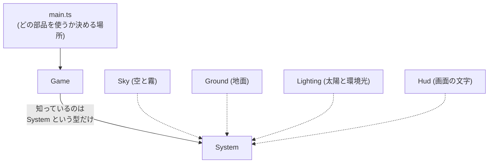
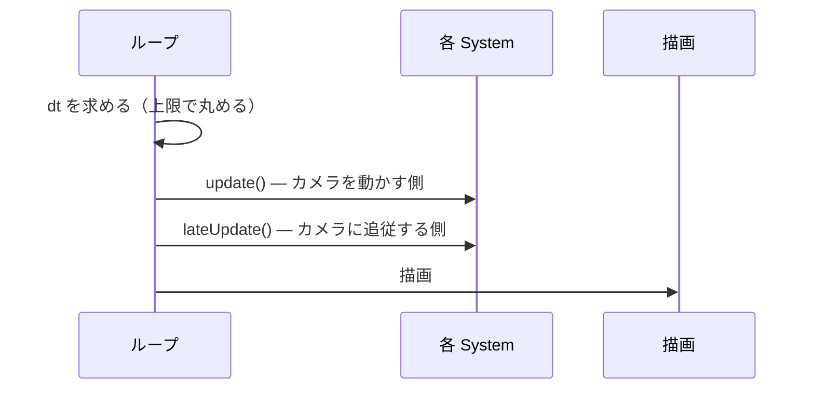

# M0: 土台とデプロイ — 実装概要

対応 Issue: #2 / PR: #5

## これで何ができるようになったか

- `main` に何かが入るたび、テスト → ビルド → 公開が自動で走る
- 公開 URL: https://bubbleshaker.github.io/skyroam/
- PR を出すと、マージ前にテストとビルドが検証される
- 画面には空・地面・fps が出る（ゲーム内容は M1 以降）

## 全体の形

ゲームは「毎フレーム更新される部品」の集まりとして組み立てる。
部品の共通の形が `System`（`src/core/System.ts`）で、`Game` はこの型しか知らない。

**なぜこうしたか**: 今後 M1〜M9 で飛行・都市・人・地図・BGM を足していくが、
そのたびに `Game` を書き換えていると、中心のコードがどんどん壊れやすくなる。
`Game` が「毎フレーム `update` を呼ぶ」ことしか知らなければ、
新機能は `System` を 1 つ書いて `main.ts` で `game.add()` するだけで足せる。

## 信頼してよい境界

以下は「もう見なくてよい」レイヤー。中身を理解しなくても M1 以降を進められる。

| ファイル | 役割 | 気にしなくてよい理由 |
| --- | --- | --- |
| `core/Game.ts` | ループ・レンダラ・リサイズ | 今後ほぼ書き換わらない。新機能は System として外から足す |
| `core/device.ts` | スマホ/PC の品質切り替え | 「スマホでは影を切る」等の判断が全部ここに閉じている |
| `core/time.ts` | dt の丸め | 異常な経過時間を弾くだけ。テスト済み |
| `.github/workflows/deploy.yml` | CI/CD | 一度通れば触らない |

## 1 フレームの流れ

`update` と `lateUpdate` を分けているのは、空と地面がカメラを追いかけるため。
同じフェーズでやると、追従が常に 1 フレーム遅れて、速く動いたときにズレが見える。

## レビューで直した重要な点

reviewer サブエージェントの指摘のうち、**放置すると後で必ず壊れた**もの:

1. **タブを切り替えて戻るとゲーム内時間が 0 に戻る**
   Three.js の `Clock.start()` が経過時間をリセットする仕様だった。
   M5 の昼夜サイクルはこの時間で動かすので、タブを戻すたびに朝に戻ってしまう。
   → 非推奨だった `Clock` をやめ、`Timer` に置き換えた。

2. **空の色と霧の色が別管理だった**
   M5 で空を夜の色にしても、遠景の霧だけ昼の水色で残るところだった。
   → 霧を `Sky` の責務に含め、色を変えると両方が同時に変わるようにした。

3. **空のグラデーションが原点から離れると単色に潰れる**
   ワールド座標で計算していたため。M2 で日本から大陸へ飛ぶと発生した。
   → カメラ基準の計算に変更。

いずれも「今は動くが、後のマイルストーンで必ず表面化する」種類の欠陥だった。

## 積み残し

- WebGL コンテキストロストからの復帰 → #4（M9 で対応予定）
