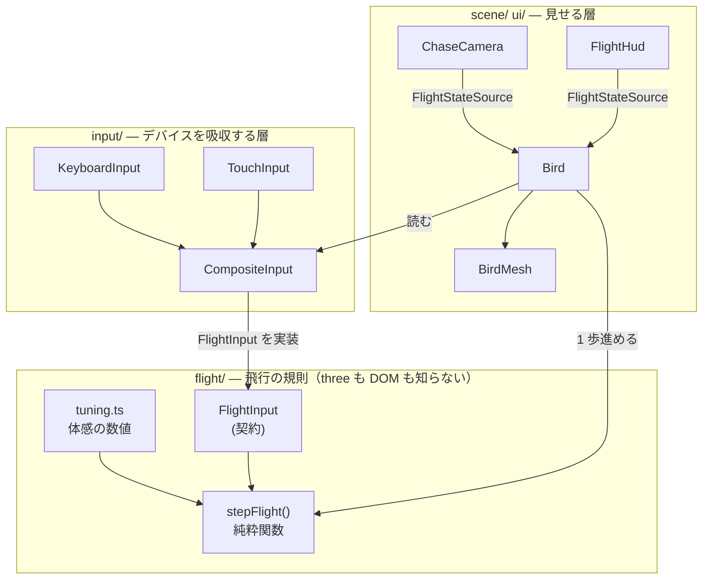

# M1: 飛行操作 — 実装概要

対応 Issue: #3

## これで何ができるようになったか

- PC でもスマホでも、鳥として自由に飛べる
- 滑空すると減速しながら降下し、羽ばたくと加速して高度を保てる
- バンクさせると旋回し、カメラも一緒に傾く
- HUD に速度と高度、失速警告が出る
- 起動時に操作説明が出て、何か触ると消える

## 全体の形

M1 で足したものは、大きく 3 つの層に分かれる。



矢印はすべて一方向で、`flight/` は誰にも依存されるが誰にも依存しない（`core/math` を除く）。

## いちばん重要な判断: 飛行の計算を three から切り離した

`stepFlight(state, input, dt, tuning)` は **three のオブジェクトを一切触らない純粋関数**で、
状態を書き換えず新しい状態を返す。

**なぜこうしたか**: 飛行の「気持ちよさ」は、数値を何十回も触って詰める作業になる。
`Object3D` を直接動かす実装だと、確認手段が「ブラウザで飛んでみる」しか無くなり、
パラメータをいじるたびに「旋回で減速する」「滑空すると降りる」といった性質が
壊れていないかを人力で確かめ続けることになる。純粋関数なら、これらを**テストで固定**できる。

実際、飛行モデルには 25 件のテストがあり、体感を調整してもこの性質は守られる。

## 飛行の規則は 4 つしかない

```
1. 入力で機首の向き（pitch / roll）が変わる。離すと水平に戻る
2. 揚力が足りないと機首が下がる（滑空・失速）
3. 機首が下向きなら加速、上向きなら減速する
4. バンクしている方向へ機首方位が回る
```

**2 と 3 が噛み合うと、書いていない挙動が勝手に生まれる**。滑空すると、

```
沈む → 機首が下がる → 加速する → 揚力が戻る → 機首が上がる → 減速する → また沈む
```

というグライダー特有の緩やかな上下動になる。これは専用のコードを 1 行も書いていない。
実測では速度 83 m/s で釣り合い、滑空比およそ 7:1 の安定した滑空になる。

「羽ばたけば高度を保てる」も、規則 2 の中の 1 行で決まっている。

```ts
const sinking = input.flap ? 0 : liftDeficit;
```

## 信頼してよい境界

| ファイル | 役割 | 気にしなくてよい理由 |
| --- | --- | --- |
| `flight/flightModel.ts` | 飛行の規則 | 25 件のテストで性質が固定されている。触るのは `tuning.ts` の方 |
| `input/*` | デバイスの吸収 | 飛行側は `FlightInput` しか見ない。デバイスが増えてもここで閉じる |
| `core/math.ts` | clamp / damp | テスト済み。`damp` はフレームレート非依存 |
| `scene/BirdMesh.ts` | 鳥の見た目 | プレースホルダー。差し替えても飛行のコードに影響しない |

## 操作感を変えたい時に触る場所

**`src/flight/tuning.ts` だけ**。飛行モデル側は定数を 1 つも持っていない。

| 感じたこと | 触る値 |
| --- | --- |
| 曲がりが鈍い / 曲がりすぎ | `turnRate` |
| 滑空でどんどん落ちる | `cruiseSpeed` を下げる、`drag` を下げる |
| 速度が出ない / 出すぎ | `maxSpeed`, `drag` |
| 機首の反応が重い | `pitchRate`, `rollRate` |
| カメラが近い / 遠い | `scene/ChaseCamera.ts` の `distance`, `followRate` |

## 座標系まわりの約束（間違えやすい所）

三人称視点のゲームで最も事故が起きるのがここ。M1 では次のように決めた。

| 決めごと | 値 |
| --- | --- |
| 機首方向 | `yaw = 0, pitch = 0` で **-z**（three の既定の前方） |
| yaw | 増える方向が**左**旋回（右手系なので上から見て反時計回り） |
| `FlightState.roll` | **+ が右バンク**。three の `rotation.z` とは**符号が逆** |
| 姿勢の合成順 | `"YXZ"` = 機首方位 → 機首の上下 → バンク（航空機の順） |

`rotation.order` を既定の `"XYZ"` のままにすると、バンクした状態でのピッチ操作が
斜めにねじれる。

この対応は `scene/orientation.test.ts` でテストしてある。純粋関数の外側なので、
リファクタで静かに壊れうる場所だから。

## レビューで直した重要な点

reviewer サブエージェントの指摘のうち、**放置すると後で必ず問題になった**もの:

1. **鳥の翼が上ではなく下に垂れていた**
   three の `rotation.z` は +x にある点を +y へ回すので、左翼（-x 側）と右翼（+x 側）は
   **どちらも正の角度で下がる**。「上反角」と名付けた定数が下反角として効いていた。
   → 左右の符号を入れ替えた。

2. **`clamp` に NaN が来ると「フルの機首下げ」になっていた**
   `-1..1` のような対称レンジで異常値に `min` を返すのは、一番危険な操作へ倒すのと同じ。
   → 範囲内で最も 0 に近い値を返すようにした。

3. **スティックが微小値で止まると、バンクが戻らなくなっていた**
   「入力がちょうど 0 の時だけ水平に戻す」実装だったため、指がわずかにずれて
   0.005 で止まると復帰が完全に停止した。
   → 復帰の強さを `(1 - |入力|)` で連続的にスケールする形にした。
   キーボードは 0 か 1 しか返さないので、PC の挙動は変わらない。

4. **入力源の生成と破棄が非対称だった**
   生成は `main.ts`、破棄は `Bird` だった。将来メニュー等が同じ入力源を共有した瞬間、
   `Bird.dispose()` が他人の入力源を殺す。
   → `CompositeInput` が `System` も実装し、寿命を `Game` に一本化した。

5. **天井の追加が、既存テスト 2 件を「通るだけのテスト」に変えていた**
   高度上限 3000m を入れたことで、`y = 90_000` から始めていたピッチ限界角のテストが
   1 フレーム目で 3000m へ瞬間移動し、そのまま地面に達して `pitch` が 0 に潰れていた。
   アサーションが「限界角を超えない」という不等号だったため、**pitch が 0 でも通る**
   状態になっていた（= クランプが壊れても検知できない）。
   → 地面にも天井にも触れない高度・時間で測り、不等号ではなく
   「限界角ちょうどに到達する」ことを要求する形にした。
   実際にクランプを半分に壊してテストが落ちることを確認済み。

6. **影の範囲が原点に固定されていた**（M0 から潜在していた）
   `DirectionalLight` は平行光なので位置を動かしても照らされ方は変わらないが、
   **影を描く範囲**は原点付近にしか無かった。M1 で初めて「原点から離れて飛ぶ」が
   可能になったため、飛び去ると鳥の影が消えるところだった。
   → 影の範囲をカメラに追従させた。

## 積み残し

- 高度上限 3000m は暫定。M5（時間と空）で高層大気の見せ方を決める時に再検討する
- 着地・歩行への遷移は M4。今は最低高度 2m でクランプし、地面すれすれを滑るだけ
- 鳥のモデルはプレースホルダー（箱と球）
- WebGL コンテキストロストからの復帰 → #4（M9 で対応予定）
