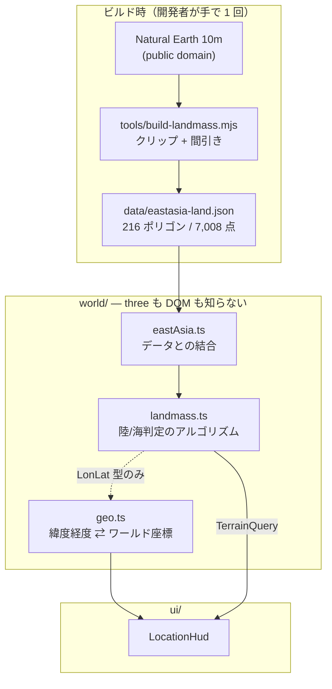

# M2: 世界座標と地形 — 実装概要

対応 Issue: #8 (M2-a)

M2 は差分が大きくなるため 2 本に分けた。このファイルは進むごとに追記する。

| | 内容 | 状態 |
| --- | --- | --- |
| M2-a | 座標変換 + 海岸線データ + 陸/海判定 + HUD 表示 | 完了 |
| M2-b | 地形描画（海面・陸地メッシュ）+ 視程調整 | 未着手 |

---

## M2-a: 世界座標と陸/海判定

### これで何ができるようになったか

見た目は M1 のまま。**変わったのは HUD に 2 行増えたことだけ**。

```
pos      35.68N 139.77E
terrain  陸上
```

飛ぶとこの緯度経度が動き、東京から東へ出ると「海上」に変わる。
つまり、ワールド座標が実在の地理と結び付いた。

### 全体の形



依存は `main → ui → world → core` の一方向。`world/` は three を一切 import しない。

### いちばん重要な判断: 投影を「正確さ」より「逆変換の厳密さ」で選んだ

経度 1 度の長さは緯度で変わる（極では 0）。これを**原点の緯度で固定**した。

```ts
const METERS_PER_LON_DEGREE =
  METERS_PER_LON_DEGREE_AT_EQUATOR * Math.cos(degToRad(ORIGIN.lat));
```

**なぜ**: こうすると `lonLatToWorld` が完全な線形写像になり、逆変換が割り算 1 回で厳密に求まる。
メルカトルのような正しい投影だと、逆変換に対数と指数が要り、往復で誤差が残る。

代償として、東西方向の距離が原点から離れるほど過大になる（北緯 50 度で 1.25 倍）。
だがこれは「ソウルが少し遠い」程度の話で、遊びの体験には出てこない。
一方、往復の誤差で現在地表示と地図がずれるのは即座に破綻として見える。

**この近似の限界は `geo.test.ts` にテストとして書いてある**（「原点から離れるほど東西方向が
過大になる」）。M7 で地図に距離を出す時、ここを読めば何が起きるか分かる。

### 海岸線データは「ビルド時に加工して commit」

`tools/build-landmass.mjs` を開発時に手で 1 回走らせ、生成物を commit する。
**ゲーム本体は実行時にネットワークへ出ない**（GitHub Pages の静的配信のまま）。

生成の 3 段階:

1. **bbox でクリップ**（Sutherland–Hodgman）— これが無いと成立しない。Natural Earth では
   ユーラシア大陸が 1 個の巨大ポリゴンとして入っており、丸ごと持つと数万点になる
2. **間引き**（Douglas–Peucker、許容誤差 0.01° ≒ 1.1km）
3. **座標を丸めて平坦な配列に**

順序に意味がある。**クリップが先**でなければならない。bbox は凸なので、間引きが残した点
どうしを結ぶ弦は必ず bbox 内に収まる。逆順だとこの保証が崩れ、陸地が範囲外へはみ出しうる。

#### 解像度の選定

| 解像度 / 間引き | 原寸 | gzip | 頂点数 |
| --- | --- | --- | --- |
| 50m / 0.01° | 35 KB | 15 KB | 2,100 |
| 10m / 0.02° | 67 KB | 27 KB | 4,039 |
| **10m / 0.01°（採用）** | **116 KB** | **41 KB** | **7,008** |

50m だと日本列島の形が潰れる。ゲームが始まるのが東京で、M3 の都市生成もそこなので、
gzip 41 KB は妥当な対価と判断した。

#### 入力を commit SHA で固定してある

```js
const SOURCE_COMMIT = "0b9a6ceb0a7032713abd9460ac1e995a9c60cd1e";
```

`master` を指していると、上流が更新された時に同じコマンドから別の生成物が出て、
「なぜ海岸線が変わったのか」を後から辿れない。生成物には入力の SHA-256 も記録している。

### 陸/海判定は even-odd 規則の ray casting

点から東へ半直線を伸ばし、リングの辺を横切った回数が奇数なら内側。
**穴（湖）の処理に専用のコードが要らない**のがこの規則を選んだ理由で、
穴の中の点は外周で 1 回・穴で 1 回横切って偶数になり、自動的に「外」になる。

速度はポリゴンごとの bbox で先に弾くだけで足りる（216 個の線形走査）。
空間索引は作っていない。

### 信頼してよい境界

| ファイル | 役割 | 気にしなくてよい理由 |
| --- | --- | --- |
| `world/geo.ts` | 座標変換 | 往復・実距離との突き合わせをテストで固定。触るのは `SCALE` だけ |
| `world/landmass.ts` | 陸/海判定 | 合成データで境界条件（頂点上、穴、退化リング）を固定済み |
| `tools/build-landmass.mjs` | データ生成 | 27 件のテストがある。普段は走らせる必要が無い |
| `world/data/*.json` | 生成物 | 手で編集しない。作り直すならスクリプト経由 |

### 世界を広くしたい / 狭くしたい時に触る場所

**`src/world/geo.ts` の `SCALE` だけ**。20 を 10 にすれば世界は 2 倍広くなる。
現状の値だと東京→ソウルが約 58km（巡航 100m/s で約 10 分）。

範囲そのものを変えるなら `tools/build-landmass.mjs` の `BBOX` を変えて再生成する。

### 途中で判明した PLAN.md の矛盾

**PLAN.md の対象範囲 東経 118° だと、北京 (116.4°E) が範囲外だった。**
PLAN.md §3 は北京を都市シードに挙げているので、範囲の方を 114°E に広げ、PLAN.md も直した。
テストを書いていて落ちたので気づいた。

### レビューで直した重要な点

reviewer の指摘に 🔴 must は無かったが、🟡 should が 8 件あり全部潰した。
**放置すると後で必ず問題になった**もの:

1. **壊れたデータが「世界が全部海」に化けていた**
   `const [minLon = 0, ...] = source.bbox` は、bbox が欠けると全部 0 になる。
   すると `covers()` がどこでも false → `isLand()` が常に false → 陸が消える。
   **例外は出ない**ので、HUD が全部「範囲外」と出るまで誰も気づかない。
   → コンストラクタで bbox の要素数・有限性・反転を検査して throw する。

2. **リング長が奇数だと経度と緯度が入れ替わって読まれていた**
   `ring.length / 2` が小数になり、添字が `x.5` になる。`undefined` が NaN 比較として
   素通りするので、**例外も出ずに誤った判定を返す**。
   → 同じくコンストラクタで検査する。

   1 と 2 はどちらも JSON が `as` キャストで型検査を迂回して入ってくることが原因だった。
   タプル型にして押し込むより、境界で実際に検査する方を選んだ。おかげでキャストが消えた。

3. **生成スクリプトの幾何アルゴリズムが 1 行もテストされておらず、構造上テストできなかった**
   トップレベルで `fetch` → `writeFileSync` が走るため、import した瞬間に副作用が出る。
   間接的に守っていたのは実データの地理アサーション（東京は陸、日本海は海）だけで、
   **許容誤差を 5 倍にして海岸線をかなり潰しても全部通ってしまう**網の粗さだった。
   → 純粋関数を export し、実行を `import.meta.url === argv[1]` で囲って 27 件のテストを追加。
   ついでに `build()` がモジュール定数の bbox を直接読んでいたのも引数化した（これが無いと
   東アジアの座標を持ったテストデータでしか検査できない）。

4. **`worldToRealMeters` が「実距離」を返していなかった**
   投影の歪みは SCALE を掛け戻しても戻らない（北緯 50 度で 26% 過大）。
   しかもテストが `expect(f(x)).toBeCloseTo(x * SCALE)` という、実装と同じ式を書いた
   **恒真アサーション**だった。本番から 1 箇所も呼ばれていなかったので削除した。
   代わりに、都市への距離を haversine の実距離と ±10% で突き合わせるテストを入れた。
   独立した式で照らすので、定数の取り違えも南北の反転も一度に捕まる。

5. **UI が具象クラス `Landmass` に依存していた**
   HUD が要るのは `covers()` と `isLand()` だけなのに、`polygons`（M2-b のメッシュ生成用）
   まで見える型を受けていた。同じファイルの飛行状態が `FlightStateSource` という
   細い契約で受けているのと不揃いだった。
   → `TerrainQuery` を切り出した。M2-b や M4 で実装が変わっても UI は変わらない。

6. **成果物テストの下限が緩すぎた**
   `polygons.length > 50`（実測 216）では、再生成でデータが激変しても通る。
   → ポリゴン数と総頂点数を実測値ちょうどで固定した。
   壁時計に依存する速度テストは、落ちても意味が読み取れないので外した。

### 積み残し

- **湖が陸のまま**。Natural Earth の land レイヤは内陸湖を穴として持たないので、
  琵琶湖などは `isLand` が true を返す。even-odd の穴処理は実装済みだが実データでは出番が無い。
  直すなら lakes レイヤを穴として合成する。M2-b で地形を描くと目に見えるようになる
  （`eastAsia.test.ts` に現状を固定したテストがあり、直したら反転させる）
- 陸/海判定に空間索引は無い。216 ポリゴンの線形走査で足りているが、
  M3 でチャンクごとに大量に呼ぶなら再検討する
- JSON はバンドルに inline されている。M9 で別チャンクにするか検討する余地がある
